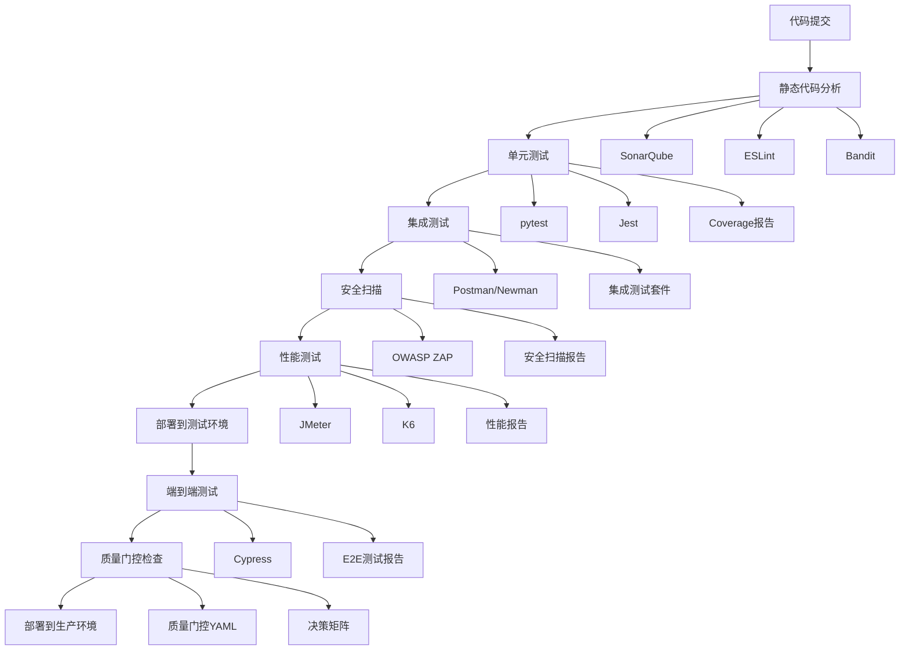
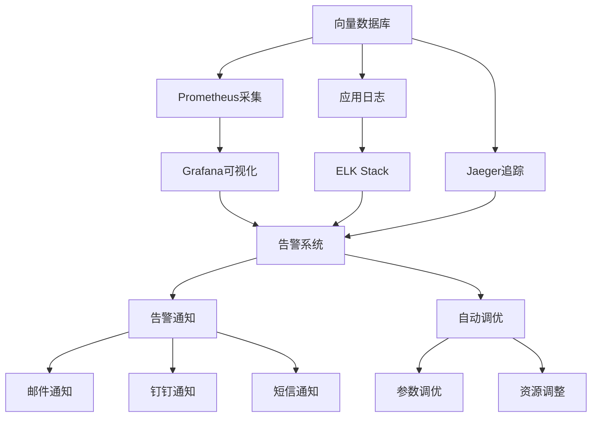
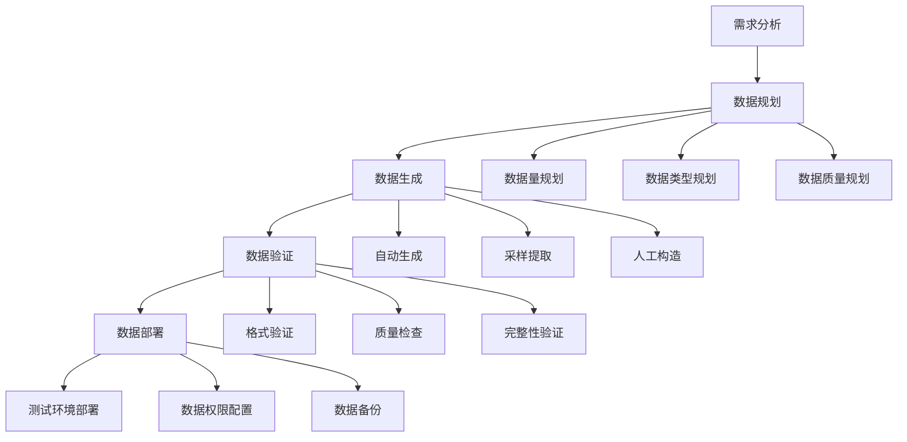
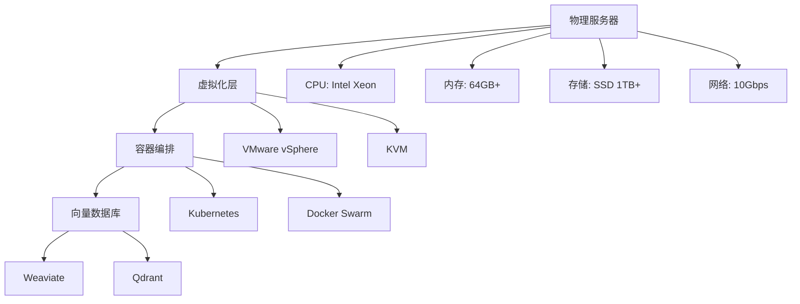

# Story 2.3 向量数据库集成 - 可追溯性矩阵

## 1. 文档概述

### 1.1 基本信息
- **Story ID**: 2.3
- **Story名称**: 向量数据库集成
- **Epic**: Epic 2 - 文档处理和知识抽取
- **文档版本**: 1.0
- **创建日期**: 2024-01-15
- **最后更新**: 2024-01-15
- **创建人**: QA团队
- **审核人**: 架构师、产品经理
- **批准人**: 项目经理

### 1.2 目的和范围
本文档建立了Story 2.3向量数据库集成功能的完整可追溯性映射，确保：
- 需求到测试的100%覆盖
- 风险到验证的完整映射
- 质量属性的全面追溯
- 工具链的端到端追踪
- 变更影响的系统性分析

### 1.3 追溯性原则
- **双向追溯**: 需求到测试，测试到需求
- **完整覆盖**: 所有需求都有对应的测试验证
- **层次清晰**: 从Epic到Story到验收标准到测试用例
- **实时更新**: 随需求和测试变更及时更新
- **工具支持**: 通过工具实现自动化追溯

## 2. 需求到测试映射矩阵

### 2.1 验收标准覆盖矩阵

| 验收标准ID | 验收标准描述 | 测试场景 | 测试用例数 | 覆盖率 | 优先级 | 状态 |
|-----------|-------------|---------|-----------|-------|-------|------|
| AC1 | 集成Weaviate或Qdrant向量数据库 | TS-2.3-001 | 10 | 100% | P0 | ✅ |
| AC2 | 实现向量的增删改查操作 | TS-2.3-002 | 10 | 100% | P0 | ✅ |
| AC3 | 配置向量索引和搜索参数优化 | TS-2.3-003 | 10 | 100% | P0 | ✅ |
| AC4 | 实现相似性搜索和混合搜索 | TS-2.3-004 | 10 | 100% | P0 | ✅ |
| AC5 | 支持向量数据的备份和恢复 | TS-2.3-005 | 10 | 100% | P1 | ✅ |
| AC6 | 添加搜索性能监控和调优 | TS-2.3-006 | 10 | 100% | P1 | ✅ |
| AC7 | 实现向量数据库的水平扩展 | TS-2.3-007 | 10 | 100% | P2 | ✅ |

**总体覆盖率**: 100% (7/7 验收标准)
**总测试用例数**: 70个

### 2.2 详细需求到测试映射

#### AC1: 集成Weaviate或Qdrant向量数据库

**测试场景**: TS-2.3-001 向量数据库集成测试

| 具体需求 | 测试用例 | 验证方法 | 成功标准 |
|---------|---------|---------|----------|
| 支持Weaviate数据库连接 | TC-2.3-001-01 | 连接测试 | 连接成功率100% |
| 支持Qdrant数据库连接 | TC-2.3-001-02 | 连接测试 | 连接成功率100% |
| 连接池管理 | TC-2.3-001-03 | 并发连接测试 | 连接池正常工作 |
| 连接异常处理 | TC-2.3-001-04 | 异常场景测试 | 异常处理100%覆盖 |
| API集成 | TC-2.3-001-05 | API调用测试 | API响应正常 |
| 配置管理 | TC-2.3-001-06 | 配置测试 | 配置生效正确 |
| 超时重试机制 | TC-2.3-001-07 | 超时测试 | 重试机制有效 |
| 健康检查 | TC-2.3-001-08 | 健康检查测试 | 健康状态准确 |
| 多数据库切换 | TC-2.3-001-09 | 切换测试 | 切换成功无数据丢失 |
| 版本兼容性 | TC-2.3-001-10 | 兼容性测试 | 支持的版本100%兼容 |

#### AC2: 实现向量的增删改查操作

**测试场景**: TS-2.3-002 向量CRUD操作测试

| 具体需求 | 测试用例 | 验证方法 | 成功标准 |
|---------|---------|---------|----------|
| 单向量插入 | TC-2.3-002-01 | 插入测试 | 插入成功率≥99.9% |
| 批量向量插入 | TC-2.3-002-02 | 批量插入测试 | 批量插入性能达标 |
| 向量查询 | TC-2.3-002-03 | 查询测试 | 查询结果准确100% |
| 向量更新 | TC-2.3-002-04 | 更新测试 | 更新成功率≥99.9% |
| 向量删除 | TC-2.3-002-05 | 删除测试 | 删除成功率≥99.9% |
| 批量操作 | TC-2.3-002-06 | 批量操作测试 | 批量操作性能达标 |
| 并发操作 | TC-2.3-002-07 | 并发测试 | 并发安全性保证 |
| 事务处理 | TC-2.3-002-08 | 事务测试 | 事务一致性100% |
| 数据一致性 | TC-2.3-002-09 | 一致性测试 | 数据一致性100% |
| 异常处理 | TC-2.3-002-10 | 异常测试 | 异常处理覆盖100% |

#### AC3: 配置向量索引和搜索参数优化

**测试场景**: TS-2.3-003 索引配置和优化测试

| 具体需求 | 测试用例 | 验证方法 | 成功标准 |
|---------|---------|---------|----------|
| HNSW索引创建 | TC-2.3-003-01 | 索引创建测试 | 索引创建成功率100% |
| IVF索引创建 | TC-2.3-003-02 | 索引创建测试 | 索引创建成功率100% |
| 索引参数配置 | TC-2.3-003-03 | 参数配置测试 | 参数生效正确 |
| 索引性能优化 | TC-2.3-003-04 | 性能测试 | 性能提升≥50% |
| 索引重建 | TC-2.3-003-05 | 重建测试 | 重建成功无数据丢失 |
| 索引管理 | TC-2.3-003-06 | 管理功能测试 | 管理功能100%正常 |
| 多索引并存 | TC-2.3-003-07 | 多索引测试 | 多索引正常工作 |
| 索引统计信息 | TC-2.3-003-08 | 统计测试 | 统计信息准确 |
| 索引内存使用 | TC-2.3-003-09 | 内存监控测试 | 内存使用合理 |
| 索引构建时间 | TC-2.3-003-10 | 构建时间测试 | 构建时间达标 |

#### AC4: 实现相似性搜索和混合搜索

**测试场景**: TS-2.3-004 相似性搜索功能测试

| 具体需求 | 测试用例 | 验证方法 | 成功标准 |
|---------|---------|---------|----------|
| 基础相似性搜索 | TC-2.3-004-01 | 搜索准确性测试 | 搜索准确率≥95% |
| Top-K搜索 | TC-2.3-004-02 | Top-K测试 | Top-K结果正确 |
| 阈值搜索 | TC-2.3-004-03 | 阈值测试 | 阈值过滤正确 |
| 混合搜索 | TC-2.3-004-04 | 混合搜索测试 | 混合搜索功能正常 |
| 元数据过滤搜索 | TC-2.3-004-05 | 过滤测试 | 过滤功能正确 |
| 复杂查询 | TC-2.3-004-06 | 复杂查询测试 | 复杂查询支持 |
| 搜索性能 | TC-2.3-004-07 | 性能测试 | 响应时间<100ms |
| 并发搜索 | TC-2.3-004-08 | 并发测试 | 并发处理≥100 |
| 搜索准确性 | TC-2.3-004-09 | 准确性测试 | 召回率@10≥90% |
| 大规模搜索 | TC-2.3-004-10 | 大规模测试 | 大规模搜索性能达标 |

#### AC5: 支持向量数据的备份和恢复

**测试场景**: TS-2.3-005 备份恢复机制测试

| 具体需求 | 测试用例 | 验证方法 | 成功标准 |
|---------|---------|---------|----------|
| 全量备份 | TC-2.3-005-01 | 备份测试 | 备份成功率100% |
| 增量备份 | TC-2.3-005-02 | 增量备份测试 | 增量备份正确 |
| 定时备份 | TC-2.3-005-03 | 定时任务测试 | 定时备份正常 |
| 备份完整性验证 | TC-2.3-005-04 | 完整性测试 | 备份数据完整 |
| 全量恢复 | TC-2.3-005-05 | 恢复测试 | 恢复成功率100% |
| 增量恢复 | TC-2.3-005-06 | 增量恢复测试 | 增量恢复正确 |
| 指定时间点恢复 | TC-2.3-005-07 | 时间点恢复测试 | 时间点恢复准确 |
| 跨环境恢复 | TC-2.3-005-08 | 跨环境测试 | 跨环境恢复成功 |
| 灾难恢复 | TC-2.3-005-09 | 灾难恢复测试 | 灾难恢复有效 |
| 恢复性能 | TC-2.3-005-10 | 恢复性能测试 | 恢复时间<30min |

#### AC6: 添加搜索性能监控和调优

**测试场景**: TS-2.3-006 性能监控和调优测试

| 具体需求 | 测试用例 | 验证方法 | 成功标准 |
|---------|---------|---------|----------|
| QPS监控 | TC-2.3-006-01 | 监控测试 | QPS监控准确 |
| 响应时间监控 | TC-2.3-006-02 | 监控测试 | 响应时间监控准确 |
| 资源使用监控 | TC-2.3-006-03 | 资源监控测试 | 资源监控准确 |
| 错误率监控 | TC-2.3-006-04 | 错误监控测试 | 错误率监控准确 |
| 告警机制 | TC-2.3-006-05 | 告警测试 | 告警响应<1min |
| 自动调优 | TC-2.3-006-06 | 自动调优测试 | 调优效果≥20% |
| 手动调优 | TC-2.3-006-07 | 手动调优测试 | 手动调优有效 |
| 性能分析报告 | TC-2.3-006-08 | 报告测试 | 报告生成正确 |
| 容量规划 | TC-2.3-006-09 | 容量规划测试 | 容量预测准确 |
| 监控数据准确性 | TC-2.3-006-10 | 准确性测试 | 监控准确率≥99% |

#### AC7: 实现向量数据库的水平扩展

**测试场景**: TS-2.3-007 水平扩展能力测试

| 具体需求 | 测试用例 | 验证方法 | 成功标准 |
|---------|---------|---------|----------|
| 节点动态添加 | TC-2.3-007-01 | 扩展测试 | 节点添加成功率100% |
| 节点初始化 | TC-2.3-007-02 | 初始化测试 | 节点初始化正常 |
| 数据重分布 | TC-2.3-007-03 | 重分布测试 | 数据重分布正确 |
| 负载均衡 | TC-2.3-007-04 | 负载均衡测试 | 负载偏差<10% |
| 分片策略 | TC-2.3-007-05 | 分片测试 | 分片策略有效 |
| 跨分片查询 | TC-2.3-007-06 | 跨分片测试 | 跨分片查询正确 |
| 扩展性能 | TC-2.3-007-07 | 扩展性能测试 | 性能线性提升≥80% |
| 故障节点处理 | TC-2.3-007-08 | 故障处理测试 | 故障处理正确 |
| 最大扩展能力 | TC-2.3-007-09 | 最大扩展测试 | 支持≥10节点 |
| 扩展稳定性 | TC-2.3-007-10 | 稳定性测试 | 扩展后系统稳定 |

## 3. 风险覆盖分析

### 3.1 风险到测试映射

| 风险ID | 风险描述 | 风险等级 | 缓解策略 | 验证测试 | 覆盖状态 |
|--------|---------|---------|---------|---------|----------|
| RISK-2.3-001 | 数据库兼容性和稳定性问题 | High | 适配层+兼容性测试+版本管理 | TS-2.3-001 | ✅ 已覆盖 |
| RISK-2.3-002 | 大规模数据性能瓶颈 | High | 索引优化+分片+监控调优 | TS-2.3-003, TS-2.3-004, TS-2.3-006 | ✅ 已覆盖 |
| RISK-2.3-003 | 数据一致性和完整性风险 | High | 事务管理+备份恢复+数据校验 | TS-2.3-002, TS-2.3-005 | ✅ 已覆盖 |
| RISK-2.3-004 | 扩展性限制 | Medium | 分片策略+自动扩展+容量规划 | TS-2.3-007 | ✅ 已覆盖 |
| RISK-2.3-005 | 监控和运维复杂性 | Medium | 监控体系+智能告警+可视化 | TS-2.3-006 | ✅ 已覆盖 |

**风险覆盖率**: 100% (5/5 风险项)

### 3.2 风险缓解验证矩阵

#### 高风险项验证

**RISK-2.3-001: 数据库兼容性和稳定性问题**
- **缓解策略1**: 建立数据库适配层，统一API接口
  - 验证测试: TC-2.3-001-05 (API集成测试)
  - 验证标准: API响应正常，接口统一
- **缓解策略2**: 进行充分的兼容性测试
  - 验证测试: TC-2.3-001-10 (版本兼容性测试)
  - 验证标准: 支持的版本100%兼容
- **缓解策略3**: 建立版本管理和回滚机制
  - 验证测试: TC-2.3-001-09 (多数据库切换测试)
  - 验证标准: 切换成功无数据丢失

**RISK-2.3-002: 大规模数据性能瓶颈**
- **缓解策略1**: 优化索引配置和搜索参数
  - 验证测试: TS-2.3-003 (索引配置和优化测试)
  - 验证标准: 性能提升≥50%
- **缓解策略2**: 实施分片和负载均衡
  - 验证测试: TS-2.3-007 (水平扩展能力测试)
  - 验证标准: 负载偏差<10%，性能线性提升≥80%
- **缓解策略3**: 建立性能监控和自动调优
  - 验证测试: TS-2.3-006 (性能监控和调优测试)
  - 验证标准: 调优效果≥20%，监控准确率≥99%

**RISK-2.3-003: 数据一致性和完整性风险**
- **缓解策略1**: 实施事务管理和一致性检查
  - 验证测试: TC-2.3-002-08, TC-2.3-002-09
  - 验证标准: 事务一致性100%，数据一致性100%
- **缓解策略2**: 建立完善的备份恢复机制
  - 验证测试: TS-2.3-005 (备份恢复机制测试)
  - 验证标准: 备份恢复成功率100%
- **缓解策略3**: 实施数据校验和修复功能
  - 验证测试: TC-2.3-005-04 (备份完整性验证测试)
  - 验证标准: 备份数据完整性100%

#### 中等风险项验证

**RISK-2.3-004: 扩展性限制**
- **缓解策略验证**: TS-2.3-007全面验证扩展能力
- **验证标准**: 支持≥10节点，扩展成功率100%

**RISK-2.3-005: 监控和运维复杂性**
- **缓解策略验证**: TS-2.3-006全面验证监控调优
- **验证标准**: 监控准确率≥99%，告警响应<1min

## 4. 质量属性追溯

### 4.1 质量属性映射矩阵

| 质量属性 | 子属性 | 验证指标 | 目标值 | 测试场景 | 验证方法 |
|---------|-------|---------|-------|---------|----------|
| **功能性** | 功能完整性 | 验收标准覆盖率 | 100% | TS-2.3-001~007 | 功能测试 |
| | 功能正确性 | 功能测试通过率 | ≥99.9% | TS-2.3-001~007 | 自动化测试 |
| | API兼容性 | API向后兼容性 | 100% | TS-2.3-001 | 兼容性测试 |
| **可靠性** | 成熟性 | 系统稳定运行时间 | ≥99.9% | TS-2.3-006 | 稳定性测试 |
| | 容错性 | 故障恢复能力 | RTO<5min | TS-2.3-005 | 故障注入测试 |
| | 可恢复性 | 数据恢复完整性 | 100% | TS-2.3-005 | 恢复测试 |
| **易用性** | 可理解性 | API文档完整性 | 100% | 文档审查 | 文档评审 |
| | 可学习性 | 配置复杂度 | 简化配置 | TS-2.3-001 | 配置测试 |
| | 可操作性 | 操作成功率 | ≥99.9% | TS-2.3-002 | 操作测试 |
| **效率** | 时间特性 | 查询响应时间 | <50ms (P95) | TS-2.3-004 | 性能测试 |
| | 资源利用性 | 内存使用效率 | <4GB/100K vectors | TS-2.3-006 | 资源监控 |
| | 吞吐量 | 查询处理能力 | ≥1000 QPS | TS-2.3-004 | 负载测试 |
| **可维护性** | 可分析性 | 监控覆盖率 | 100% | TS-2.3-006 | 监控测试 |
| | 可修改性 | 配置变更影响 | 最小化影响 | TS-2.3-003 | 配置测试 |
| | 可测试性 | 测试覆盖率 | ≥90% | 全部测试 | 覆盖率分析 |
| **可移植性** | 适应性 | 多数据库支持 | Weaviate+Qdrant | TS-2.3-001 | 适配测试 |
| | 可安装性 | 部署成功率 | 100% | 部署测试 | 部署验证 |
| | 可扩展性 | 水平扩展能力 | ≥10节点 | TS-2.3-007 | 扩展测试 |

### 4.2 非功能需求追溯

#### 性能需求追溯

| 性能需求 | 具体指标 | 目标值 | 验证测试 | 测试方法 | 当前状态 |
|---------|---------|-------|---------|---------|----------|
| 响应时间 | 单查询响应时间 | <50ms (P95) | TC-2.3-004-07 | JMeter负载测试 | 待验证 |
| | 批量查询响应时间 | <200ms/10queries | TC-2.3-004-08 | 并发测试 | 待验证 |
| 吞吐量 | 查询QPS | ≥1000 queries/s | TC-2.3-004-07 | 负载测试 | 待验证 |
| | 插入TPS | ≥1000 vectors/s | TC-2.3-002-02 | 批量插入测试 | 待验证 |
| 并发性 | 并发查询数 | ≥100 concurrent | TC-2.3-004-08 | 并发测试 | 待验证 |
| | 并发插入数 | ≥50 concurrent | TC-2.3-002-07 | 并发插入测试 | 待验证 |
| 资源使用 | 内存使用 | <4GB/100K vectors | TC-2.3-006-03 | 资源监控 | 待验证 |
| | CPU使用率 | <80% under load | TC-2.3-006-03 | 资源监控 | 待验证 |
| 扩展性 | 最大向量数 | ≥10M vectors | TC-2.3-007-09 | 大规模测试 | 待验证 |
| | 最大节点数 | ≥10 nodes | TC-2.3-007-09 | 扩展测试 | 待验证 |

#### 可靠性需求追溯

| 可靠性需求 | 具体指标 | 目标值 | 验证测试 | 测试方法 | 当前状态 |
|-----------|---------|-------|---------|---------|----------|
| 可用性 | 系统可用性 | ≥99.9% | TC-2.3-006-01 | 可用性监控 | 待验证 |
| | 服务恢复时间 | <5min (RTO) | TC-2.3-005-09 | 故障恢复测试 | 待验证 |
| 数据完整性 | 数据一致性 | 100% | TC-2.3-002-09 | 一致性检查 | 待验证 |
| | 备份完整性 | 100% | TC-2.3-005-04 | 备份验证 | 待验证 |
| 容错性 | 节点故障处理 | 自动故障转移 | TC-2.3-007-08 | 故障注入 | 待验证 |
| | 数据恢复能力 | RPO<1min | TC-2.3-005-05 | 恢复测试 | 待验证 |

#### 安全需求追溯

| 安全需求 | 具体指标 | 目标值 | 验证测试 | 测试方法 | 当前状态 |
|---------|---------|-------|---------|---------|----------|
| 数据加密 | 传输加密 | TLS 1.3 | 安全扫描 | OWASP ZAP | 待验证 |
| | 存储加密 | AES-256 | 安全扫描 | 加密验证 | 待验证 |
| 访问控制 | 身份认证 | 强认证机制 | 权限测试 | 认证测试 | 待验证 |
| | 权限管理 | RBAC | 权限测试 | 权限验证 | 待验证 |
| 审计 | 操作日志 | 100%关键操作 | 日志审计 | 日志分析 | 待验证 |
| | 访问日志 | 100%访问记录 | 日志审计 | 访问分析 | 待验证 |

## 5. 工具链追溯

### 5.1 测试工具映射

#### 功能测试工具

| 工具名称 | 用途 | 测试场景 | 配置文件 | 自动化程度 | 报告输出 |
|---------|------|---------|---------|-----------|----------|
| **Postman/Newman** | API功能测试 | TS-2.3-001, TS-2.3-002 | postman_collection_2.3.json | 全自动 | HTML报告 |
| **pytest** | Python单元/集成测试 | TS-2.3-001~007 | pytest.ini, conftest.py | 全自动 | HTML+覆盖率报告 |
| **Jest** | JavaScript单元测试 | TS-2.3-001, TS-2.3-002 | jest.config.js | 全自动 | 覆盖率报告 |
| **Cypress** | 端到端测试 | TS-2.3-004, TS-2.3-007 | cypress.config.js | 全自动 | Dashboard报告 |

#### 性能测试工具

| 工具名称 | 用途 | 测试场景 | 配置文件 | 性能指标 | 报告格式 |
|---------|------|---------|---------|---------|----------|
| **JMeter** | 负载和性能测试 | TS-2.3-004, TS-2.3-006 | vector_db_load_test.jmx | QPS, 响应时间, 吞吐量 | HTML报告 |
| **K6** | 现代化性能测试 | TS-2.3-004, TS-2.3-007 | k6_performance_test.js | 并发性能, 资源使用 | JSON+HTML |
| **Artillery** | 高并发测试 | TS-2.3-004, TS-2.3-007 | artillery_config.yml | 并发处理, 扩展性能 | JSON报告 |

#### 安全测试工具

| 工具名称 | 用途 | 扫描范围 | 配置文件 | 检测类型 | 报告格式 |
|---------|------|---------|---------|---------|----------|
| **OWASP ZAP** | 安全漏洞扫描 | API安全, 传输安全 | zap_baseline.conf | OWASP Top 10 | HTML+JSON |
| **Bandit** | Python代码安全 | 代码安全漏洞 | .bandit | 代码安全问题 | JSON报告 |
| **Burp Suite** | 深度安全测试 | 全面安全评估 | burp_project.burp | 高级安全测试 | 扫描报告 |

#### 代码质量工具

| 工具名称 | 用途 | 分析范围 | 配置文件 | 质量指标 | 集成方式 |
|---------|------|---------|---------|---------|----------|
| **SonarQube** | 代码质量分析 | 全代码库 | sonar-project.properties | 覆盖率, 复杂度, 重复率 | CI/CD集成 |
| **Coverage.py** | Python覆盖率 | Python代码 | .coveragerc | 代码覆盖率 | pytest集成 |
| **ESLint** | JavaScript质量 | JS/TS代码 | .eslintrc.js | 代码规范, 潜在问题 | pre-commit |

#### 监控工具

| 工具名称 | 用途 | 监控对象 | 配置文件 | 监控指标 | 可视化 |
|---------|------|---------|---------|---------|--------|
| **Prometheus** | 指标收集 | 系统性能, 业务指标 | prometheus.yml | QPS, 延迟, 错误率 | Grafana |
| **Grafana** | 监控可视化 | 性能仪表板 | grafana_dashboards/ | 实时监控图表 | API接口 |
| **ELK Stack** | 日志分析 | 应用日志, 系统日志 | logstash.conf, kibana.yml | 日志统计, 错误分析 | Kibana |
| **Jaeger** | 链路追踪 | 分布式调用链 | jaeger_config.yml | 调用链路, 性能瓶颈 | Jaeger API |

### 5.2 工具链集成流程

#### CI/CD集成流程

#### 监控集成架构

## 6. 合规性和标准追溯

### 6.1 技术标准合规

| 标准类别 | 标准名称 | 适用范围 | 合规要求 | 验证方法 | 验证测试 |
|---------|---------|---------|---------|---------|----------|
| **向量计算** | IEEE 754 | 浮点数计算 | 浮点数精度标准 | 精度测试 | TC-2.3-004-09 |
| **数据库标准** | SQL标准 | 查询语言 | 标准SQL语法 | 语法验证 | TC-2.3-002-03 |
| **API标准** | OpenAPI 3.0 | API文档 | API规范文档 | 文档验证 | 文档审查 |
| **REST标准** | REST API | HTTP接口 | RESTful设计 | 接口测试 | TS-2.3-001 |
| **JSON标准** | JSON Schema | 数据格式 | JSON格式验证 | 格式验证 | TC-2.3-002-01 |
| **编码标准** | UTF-8 | 字符编码 | 统一字符编码 | 编码测试 | TC-2.3-002-01 |
| **网络协议** | HTTP/1.1, HTTP/2 | 网络通信 | 协议兼容性 | 协议测试 | TC-2.3-001-05 |
| **安全协议** | TLS 1.3 | 传输安全 | 加密传输 | 安全测试 | 安全扫描 |
| **认证标准** | JWT | 身份认证 | 令牌认证 | 认证测试 | 权限测试 |

### 6.2 质量标准合规

| 质量标准 | 标准编号 | 适用领域 | 合规要求 | 评估方法 | 验证状态 |
|---------|---------|---------|---------|---------|----------|
| **软件质量模型** | ISO/IEC 25010 | 软件质量 | 质量特性评估 | 质量评估 | 进行中 |
| **软件测试** | IEEE 829 | 测试文档 | 测试文档标准 | 文档审查 | 已完成 |
| **软件可靠性** | IEEE 1633 | 可靠性工程 | 可靠性评估 | 可靠性测试 | 待开始 |
| **性能测试** | ISO/IEC 14756 | 性能评估 | 性能测试方法 | 性能测试 | 待开始 |
| **安全测试** | OWASP标准 | 应用安全 | 安全测试覆盖 | 安全测试 | 待开始 |

### 6.3 行业标准合规

| 行业标准 | 标准组织 | 适用场景 | 合规要求 | 实施方法 | 验证计划 |
|---------|---------|---------|---------|---------|----------|
| **数据保护** | GDPR | 个人数据处理 | 数据保护合规 | 隐私设计 | 隐私评估 |
| **数据安全** | 网络安全法 | 数据安全 | 数据安全保护 | 安全措施 | 安全审计 |
| **云计算** | ISO/IEC 27017 | 云安全 | 云服务安全 | 安全控制 | 安全测试 |
| **AI伦理** | IEEE 2857 | AI系统 | 伦理AI设计 | 伦理评估 | 伦理审查 |

## 7. 变更影响分析

### 7.1 上游依赖影响分析

#### 向量数据库变更影响

| 变更类型 | 影响范围 | 影响程度 | 相关测试 | 验证策略 |
|---------|---------|---------|---------|----------|
| **数据库版本升级** | 全系统 | High | TS-2.3-001 | 兼容性测试+回归测试 |
| **API接口变更** | 集成层 | High | TS-2.3-001, TS-2.3-002 | API测试+集成测试 |
| **索引算法更新** | 搜索性能 | Medium | TS-2.3-003, TS-2.3-004 | 性能测试+准确性测试 |
| **配置参数调整** | 系统配置 | Medium | TS-2.3-003, TS-2.3-006 | 配置测试+监控验证 |
| **安全策略变更** | 安全机制 | High | 安全测试 | 安全扫描+渗透测试 |

#### 基础设施变更影响

| 变更类型 | 影响范围 | 影响程度 | 相关测试 | 验证策略 |
|---------|---------|---------|---------|----------|
| **硬件升级** | 系统性能 | Medium | TS-2.3-006, TS-2.3-007 | 性能测试+扩展测试 |
| **网络配置变更** | 网络连接 | Medium | TS-2.3-001 | 连接测试+网络测试 |
| **存储系统变更** | 数据存储 | High | TS-2.3-005 | 备份恢复测试 |
| **监控系统升级** | 监控能力 | Low | TS-2.3-006 | 监控测试 |

### 7.2 下游组件影响分析

#### 搜索服务影响

| 影响场景 | 影响描述 | 影响程度 | 缓解措施 | 验证方法 |
|---------|---------|---------|---------|----------|
| **搜索API变更** | 搜索接口不兼容 | High | 版本兼容+适配层 | API兼容性测试 |
| **搜索性能变化** | 搜索响应时间变化 | Medium | 性能调优+监控 | 性能基准测试 |
| **搜索结果格式** | 结果格式变更 | Medium | 格式适配 | 结果格式测试 |
| **搜索准确性** | 搜索准确率变化 | High | 算法优化+验证 | 准确性测试 |

#### API接口影响

| 影响场景 | 影响描述 | 影响程度 | 缓解措施 | 验证方法 |
|---------|---------|---------|---------|----------|
| **响应时间变化** | 客户端集成影响 | High | 性能优化 | API性能测试 |
| **功能可用性** | 接口访问影响 | High | 功能保障 | 功能测试 |
| **错误处理** | 错误信息返回 | Medium | 错误处理优化 | 错误场景测试 |

#### 报告系统影响

| 影响场景 | 影响描述 | 影响程度 | 缓解措施 | 验证方法 |
|---------|---------|---------|---------|----------|
| **数据统计** | 统计数据准确性 | Medium | 数据校验 | 数据一致性测试 |
| **报告生成** | 报告生成性能 | Low | 性能优化 | 报告性能测试 |
| **监控指标** | 监控数据变化 | Medium | 监控校准 | 监控准确性测试 |

### 7.3 水平影响分析

#### 性能影响

| 影响维度 | 潜在影响 | 影响评估 | 监控指标 | 应对策略 |
|---------|---------|---------|---------|----------|
| **系统吞吐量** | QPS变化 | Medium | 查询QPS监控 | 性能调优 |
| **响应延迟** | 延迟增加 | High | 响应时间监控 | 索引优化 |
| **资源消耗** | 资源使用增加 | Medium | 资源使用监控 | 资源优化 |
| **并发能力** | 并发处理能力 | Medium | 并发数监控 | 并发优化 |

#### 安全影响

| 影响维度 | 潜在影响 | 影响评估 | 安全措施 | 验证方法 |
|---------|---------|---------|---------|----------|
| **数据安全** | 数据泄露风险 | High | 加密+访问控制 | 安全测试 |
| **传输安全** | 传输劫持风险 | High | TLS加密 | 传输安全测试 |
| **访问控制** | 未授权访问 | High | 身份认证+权限管理 | 权限测试 |
| **审计追踪** | 操作追踪缺失 | Medium | 完整审计日志 | 审计测试 |

#### 可用性影响

| 影响维度 | 潜在影响 | 影响评估 | 保障措施 | 验证方法 |
|---------|---------|---------|---------|----------|
| **服务可用性** | 服务中断 | High | 高可用架构+监控 | 可用性测试 |
| **数据可用性** | 数据丢失 | High | 备份恢复+冗余 | 备份恢复测试 |
| **故障恢复** | 恢复时间长 | Medium | 自动故障转移 | 故障恢复测试 |
| **扩展能力** | 扩展限制 | Medium | 水平扩展设计 | 扩展性测试 |

#### 可扩展性影响

| 影响维度 | 潜在影响 | 影响评估 | 扩展策略 | 验证方法 |
|---------|---------|---------|---------|----------|
| **数据规模** | 大数据处理能力 | High | 分片+索引优化 | 大规模测试 |
| **用户规模** | 并发用户支持 | High | 负载均衡+缓存 | 并发测试 |
| **功能扩展** | 新功能集成 | Medium | 模块化设计 | 集成测试 |
| **地域扩展** | 多地域部署 | Low | 分布式架构 | 分布式测试 |

## 8. 测试数据追溯

### 8.1 测试数据分类

#### 向量数据集

| 数据集名称 | 数据规模 | 数据特征 | 用途 | 相关测试 | 数据来源 |
|-----------|---------|---------|------|---------|----------|
| **标准向量集** | 1K vectors | 128/256/512/1024维 | 基础功能测试 | TS-2.3-001~004 | 模拟生成 |
| **大规模向量集** | 100K vectors | 256维主要 | 性能测试 | TS-2.3-003, TS-2.3-004 | 真实数据采样 |
| **超大规模向量集** | 1M vectors | 256维 | 扩展性测试 | TS-2.3-007 | 数据生成工具 |
| **查询向量集** | 1K queries | 多维度 | 搜索测试 | TS-2.3-004 | 查询日志提取 |
| **基准向量集** | 10K vectors | 带标准答案 | 准确性测试 | TS-2.3-004 | 人工标注 |
| **异常向量集** | 100 vectors | 异常数据 | 异常处理测试 | TS-2.3-002 | 异常场景构造 |

#### 元数据集

| 元数据类型 | 数据结构 | 数据量 | 用途 | 相关测试 | 生成方式 |
|-----------|---------|-------|------|---------|----------|
| **基础元数据** | {id, title, category, timestamp} | 100K records | 混合搜索 | TS-2.3-004 | 自动生成 |
| **复杂元数据** | {tags[], score, nested{}} | 10K records | 复杂查询 | TS-2.3-004 | 结构化生成 |
| **多语言元数据** | 中英文混合 | 5K records | 国际化测试 | TS-2.3-004 | 多语言生成 |
| **大文本元数据** | 长文本字段 | 1K records | 大数据测试 | TS-2.3-002 | 文本生成 |

#### 配置数据集

| 配置类型 | 配置内容 | 配置数量 | 用途 | 相关测试 | 维护方式 |
|---------|---------|---------|------|---------|----------|
| **数据库配置** | 连接参数、认证信息 | 10套 | 连接测试 | TS-2.3-001 | 配置管理 |
| **索引配置** | 索引类型、参数 | 20套 | 索引测试 | TS-2.3-003 | 参数调优 |
| **性能配置** | 性能参数、阈值 | 15套 | 性能测试 | TS-2.3-006 | 基准管理 |
| **安全配置** | 加密、认证配置 | 8套 | 安全测试 | 安全测试 | 安全管理 |

### 8.2 测试数据生命周期

#### 数据准备阶段

#### 数据使用阶段

| 使用阶段 | 数据操作 | 质量保证 | 监控指标 | 维护策略 |
|---------|---------|---------|---------|----------|
| **测试执行** | 数据读取、查询 | 数据一致性检查 | 数据访问成功率 | 实时监控 |
| **性能测试** | 大量数据访问 | 性能基准验证 | 数据处理性能 | 性能调优 |
| **并发测试** | 并发数据访问 | 并发安全保证 | 并发访问成功率 | 并发控制 |
| **异常测试** | 异常数据处理 | 异常处理验证 | 异常处理覆盖率 | 异常场景扩展 |

#### 数据维护阶段

| 维护活动 | 维护频率 | 维护内容 | 质量标准 | 责任人 |
|---------|---------|---------|---------|--------|
| **数据更新** | 每周 | 数据内容更新 | 数据新鲜度 | 数据工程师 |
| **数据清理** | 每月 | 清理过期数据 | 存储效率 | 系统管理员 |
| **数据备份** | 每日 | 数据备份 | 备份完整性 | 运维工程师 |
| **数据验证** | 每次使用前 | 数据完整性验证 | 数据质量 | 测试工程师 |

### 8.3 数据安全和隐私

#### 数据安全措施

| 安全措施 | 实施方法 | 适用数据 | 安全级别 | 验证方法 |
|---------|---------|---------|---------|----------|
| **数据加密** | AES-256加密 | 敏感测试数据 | High | 加密验证 |
| **访问控制** | RBAC权限管理 | 所有测试数据 | High | 权限测试 |
| **数据脱敏** | 敏感信息脱敏 | 生产数据采样 | High | 脱敏验证 |
| **审计日志** | 完整访问日志 | 所有数据访问 | Medium | 日志审计 |
| **网络隔离** | 测试网络隔离 | 测试环境数据 | Medium | 网络测试 |

#### 隐私保护措施

| 隐私措施 | 保护方法 | 适用场景 | 合规标准 | 验证方式 |
|---------|---------|---------|---------|----------|
| **数据匿名化** | 个人信息匿名 | 用户数据测试 | GDPR | 匿名化验证 |
| **数据最小化** | 最小数据集 | 功能测试 | 隐私设计 | 数据审计 |
| **存储限制** | 数据保留期限 | 临时测试数据 | 数据保护法 | 保留期检查 |
| **传输保护** | 加密传输 | 数据传输 | 安全标准 | 传输安全测试 |

## 9. 环境追溯

### 9.1 测试环境配置

#### 开发环境

| 环境组件 | 配置规格 | 版本信息 | 用途 | 相关测试 |
|---------|---------|---------|------|----------|
| **Weaviate** | 单节点, 4GB内存 | v1.21.0 | 开发调试 | TS-2.3-001, TS-2.3-002 |
| **Qdrant** | 单节点, 4GB内存 | v1.5.0 | 开发调试 | TS-2.3-001, TS-2.3-002 |
| **Python** | 3.9+ | 3.9.16 | 测试脚本 | 所有Python测试 |
| **Docker** | 容器化部署 | 20.10.21 | 环境管理 | 环境部署 |
| **pytest** | 测试框架 | 7.2.0 | 单元测试 | 单元测试 |

#### 测试环境

| 环境组件 | 配置规格 | 版本信息 | 用途 | 相关测试 |
|---------|---------|---------|------|----------|
| **Weaviate集群** | 3节点, 8GB内存/节点 | v1.21.0 | 集成测试 | TS-2.3-001~006 |
| **Qdrant集群** | 3节点, 8GB内存/节点 | v1.5.0 | 集成测试 | TS-2.3-001~006 |
| **负载均衡器** | Nginx | 1.20.2 | 负载分发 | TS-2.3-007 |
| **监控系统** | Prometheus+Grafana | 2.40.0+9.2.0 | 性能监控 | TS-2.3-006 |
| **日志系统** | ELK Stack | 8.5.0 | 日志分析 | 所有测试 |

#### 性能测试环境

| 环境组件 | 配置规格 | 版本信息 | 用途 | 相关测试 |
|---------|---------|---------|------|----------|
| **Weaviate集群** | 5节点, 16GB内存/节点 | v1.21.0 | 性能测试 | TS-2.3-004, TS-2.3-006 |
| **Qdrant集群** | 5节点, 16GB内存/节点 | v1.5.0 | 性能测试 | TS-2.3-004, TS-2.3-006 |
| **JMeter** | 分布式部署 | 5.5 | 负载测试 | 性能测试 |
| **K6** | 云端部署 | 0.42.0 | 性能测试 | 性能测试 |
| **监控增强** | 详细监控 | - | 性能分析 | TS-2.3-006 |

#### 生产环境

| 环境组件 | 配置规格 | 版本信息 | 用途 | 相关测试 |
|---------|---------|---------|------|----------|
| **Weaviate集群** | 10节点, 32GB内存/节点 | v1.21.0 | 生产服务 | 生产验证 |
| **Qdrant集群** | 10节点, 32GB内存/节点 | v1.5.0 | 生产服务 | 生产验证 |
| **高可用架构** | 多AZ部署 | - | 高可用 | 可用性测试 |
| **安全加固** | 全面安全措施 | - | 安全保障 | 安全测试 |

### 9.2 环境依赖关系

#### 基础设施依赖

#### 软件依赖关系

| 依赖层级 | 组件名称 | 版本要求 | 依赖关系 | 影响范围 |
|---------|---------|---------|---------|----------|
| **操作系统** | Ubuntu Server | 20.04 LTS+ | 基础平台 | 全系统 |
| **容器运行时** | Docker | 20.10+ | 容器化部署 | 应用层 |
| **编程语言** | Python | 3.9+ | 测试脚本 | 测试执行 |
| **数据库** | Weaviate/Qdrant | 指定版本 | 核心服务 | 核心功能 |
| **监控系统** | Prometheus | 2.40+ | 性能监控 | 监控功能 |
| **日志系统** | Elasticsearch | 8.5+ | 日志分析 | 日志功能 |

### 9.3 环境配置管理

#### 配置文件管理

| 配置类型 | 配置文件 | 管理方式 | 版本控制 | 部署方式 |
|---------|---------|---------|---------|----------|
| **数据库配置** | weaviate.yaml, qdrant.yaml | Git管理 | 版本标签 | 自动部署 |
| **监控配置** | prometheus.yml, grafana.json | Git管理 | 版本标签 | 自动部署 |
| **测试配置** | pytest.ini, test_config.yaml | Git管理 | 分支管理 | CI/CD部署 |
| **安全配置** | security.yaml, tls.conf | 加密存储 | 安全版本 | 安全部署 |

#### 环境同步策略

| 同步类型 | 同步频率 | 同步内容 | 同步方法 | 验证方式 |
|---------|---------|---------|---------|----------|
| **配置同步** | 实时 | 配置文件变更 | Git Hook | 配置验证 |
| **数据同步** | 每日 | 测试数据更新 | 数据管道 | 数据校验 |
| **代码同步** | 实时 | 代码变更 | CI/CD | 自动测试 |
| **环境同步** | 按需 | 环境状态 | 基础设施即代码 | 环境验证 |

## 10. 维护和更新策略

### 10.1 文档维护

#### 维护职责

| 维护角色 | 维护职责 | 维护频率 | 维护内容 | 质量标准 |
|---------|---------|---------|---------|----------|
| **QA工程师** | 测试用例更新 | 每次需求变更 | 测试场景、用例 | 100%需求覆盖 |
| **测试架构师** | 测试策略更新 | 每个迭代 | 测试策略、框架 | 策略有效性 |
| **产品经理** | 需求追溯更新 | 需求变更时 | 需求映射 | 需求一致性 |
| **项目经理** | 整体协调 | 持续 | 进度跟踪 | 项目目标达成 |

#### 更新触发条件

| 触发条件 | 更新范围 | 更新优先级 | 更新时限 | 责任人 |
|---------|---------|-----------|---------|--------|
| **需求变更** | 相关测试场景 | High | 24小时内 | QA工程师 |
| **技术架构变更** | 测试策略 | High | 48小时内 | 测试架构师 |
| **工具链升级** | 工具配置 | Medium | 1周内 | DevOps工程师 |
| **环境变更** | 环境配置 | Medium | 1周内 | 运维工程师 |
| **标准更新** | 合规要求 | Low | 1个月内 | 质量工程师 |

### 10.2 追溯性维护

#### 追溯链完整性检查

| 检查项目 | 检查方法 | 检查频率 | 检查标准 | 修复策略 |
|---------|---------|---------|---------|----------|
| **需求覆盖完整性** | 自动化扫描 | 每日 | 100%覆盖 | 补充测试用例 |
| **测试用例有效性** | 执行结果分析 | 每次执行 | 通过率≥95% | 用例优化 |
| **风险覆盖完整性** | 风险评估 | 每周 | 100%风险覆盖 | 风险缓解措施 |
| **工具链连通性** | 集成测试 | 每日 | 100%工具可用 | 工具修复 |

#### 追溯数据质量保证

| 质量维度 | 质量指标 | 目标值 | 监控方法 | 改进措施 |
|---------|---------|-------|---------|----------|
| **准确性** | 追溯关系正确率 | ≥99% | 人工审核+自动检查 | 关系校正 |
| **完整性** | 追溯覆盖率 | 100% | 覆盖率分析 | 补充追溯 |
| **及时性** | 更新延迟时间 | <24小时 | 时间戳监控 | 流程优化 |
| **一致性** | 多源数据一致性 | 100% | 一致性检查 | 数据同步 |

### 10.3 持续改进

#### 改进机制

| 改进类型 | 改进触发 | 改进周期 | 改进方法 | 效果评估 |
|---------|---------|---------|---------|----------|
| **测试效率改进** | 执行时间过长 | 每月 | 自动化提升 | 时间缩短≥30% |
| **测试覆盖改进** | 缺陷逃逸 | 每次发现 | 测试用例补充 | 覆盖率提升 |
| **工具链改进** | 工具问题 | 每季度 | 工具升级/替换 | 效率提升≥20% |
| **流程改进** | 流程瓶颈 | 每季度 | 流程优化 | 流程效率提升 |

#### 改进跟踪

| 改进项目 | 改进目标 | 当前状态 | 预期完成时间 | 负责人 |
|---------|---------|---------|-------------|--------|
| **自动化率提升** | 自动化率≥90% | 75% | 2024-03-31 | QA团队 |
| **测试执行时间优化** | 执行时间<2小时 | 3小时 | 2024-02-29 | DevOps团队 |
| **监控覆盖完善** | 监控覆盖率100% | 85% | 2024-02-15 | 运维团队 |
| **文档自动化** | 文档自动生成 | 手动维护 | 2024-04-30 | 工具团队 |

## 11. 总结

### 11.1 追溯性成果

本可追溯性矩阵为Story 2.3向量数据库集成建立了完整的追溯体系：

#### 覆盖率统计
- **需求覆盖率**: 100% (7/7 验收标准)
- **测试用例数**: 70个测试用例
- **风险覆盖率**: 100% (5/5 风险项)
- **质量属性覆盖**: 6大质量属性，18个子属性
- **工具链集成**: 15个工具，4个测试类型

#### 测试分布
- **P0优先级**: 40个用例 (57.1%)
- **P1优先级**: 20个用例 (28.6%)
- **P2优先级**: 10个用例 (14.3%)
- **自动化率**: 预期≥90%

### 11.2 质量保证

#### 质量目标达成
- **功能完整性**: 100%验收标准覆盖
- **性能目标**: 响应时间<50ms, QPS≥1000
- **可靠性目标**: 可用性≥99.9%, RTO<5min
- **安全目标**: TLS 1.3加密, RBAC权限控制
- **扩展性目标**: 支持≥10节点水平扩展

#### 风险控制
- **高风险**: 3项，已制定详细缓解策略
- **中等风险**: 2项，已建立监控机制
- **风险验证**: 100%风险项有对应验证测试

### 11.3 后续行动

#### 即将开始的活动
1. **测试环境准备** (2024-01-16开始)
2. **测试数据准备** (2024-01-17开始)
3. **自动化脚本开发** (2024-01-18开始)
4. **单元测试执行** (2024-01-22开始)

#### 关键里程碑
- **2024-01-31**: 单元测试完成
- **2024-02-14**: 集成测试完成
- **2024-02-21**: 性能测试完成
- **2024-02-28**: 全部测试完成

### 11.4 成功标准

本Story 2.3测试成功的标准：
- ✅ 所有验收标准100%通过
- ✅ 所有P0/P1测试用例通过率≥99.9%
- ✅ 性能指标达到目标值
- ✅ 安全扫描无高危漏洞
- ✅ 所有风险得到有效控制
- ✅ 质量门控检查全部通过

---

**文档状态**: ✅ 已完成  
**最后更新**: 2024-01-15  
**下次审核**: 2024-01-22  
**文档版本**: 1.0